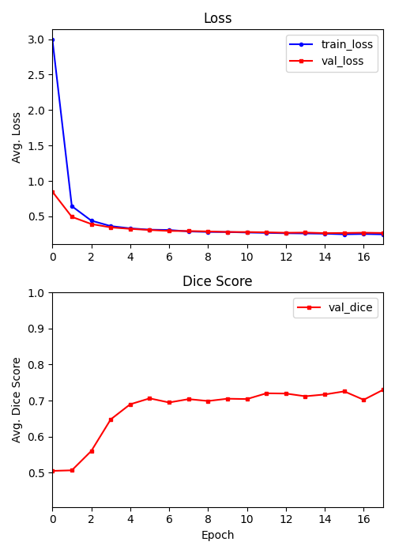
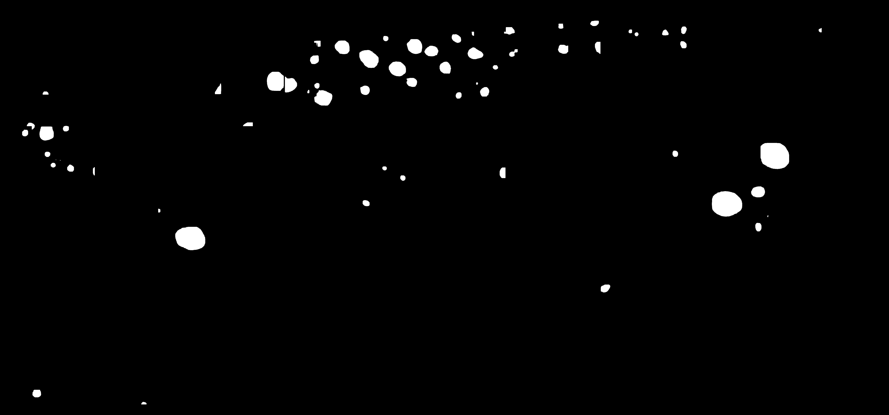

<h1>Coral Reef Halo Segmentation</h1>

     

This repository contains a complete deep-learning workflow for automated coral reef halo segmentation using high-resolution satellite imagery with Mask R-CNN. Originally implemented in ArcGIS, the pipeline has been reimplemented here with PyTorch to create an open-source method for large-scale ecological monitoring. This tool is being used to train the model that is implemented in our <a href="https://huggingface.co/spaces/civond/coral_reef_segmentation">web application</a> (work in progress).
   
The model is trained to extract reef halo features (ex: clear sand rings surrounding reef patches), which are important indicators of reef health, herbivory pressure, and predator–prey dynamics. The training dataset consists of manually annotated halos collected from diverse reef environments. The codebase includes all stages of the pipeline, from data preprocessing, model training, validation, inference, and a cross validation function to evaluate the quality of the dataset. After training, our model can be used for semantic segmentation of coral reef halos from unseen satellite images.

<h2>Training Procedure:</h2>

Model training was performed on a NVIDIA RTX A6000 GPU with the AdamW optimizer. To prevent gradient explosion and ensure stable convergence, we applied gradient clipping $(c = 1.0)$, momentum $(\beta_1 = 0.9$ and $\beta_2 = 0.999)$, and weight decay $(\lambda = 1 \times 10^{-4})$ with $batch\_size = 128$ and $LR = 1 \times 10^{-5}$. Loss and Dice scores were computed across training epochs, indicating smooth and stable convergence (figure 1).

    

An early stopping mechanism $(p=3)$ based on the validation loss was applied to prevent overfitting with a minimum improvement threshold of $min\_delta= 0.001$.

    

<h2>Results:</h2>

Our model sucessfully segments halos from previously unseen satellite images with reasonable accuracy (see figures below). However, the generated masks are not perfect. Given the Dice score observed during training (see training procedure), this result is expected. Producing usable masks currently requires a low confidence threshold during inference.

In future iterations, we aim to improve the quality of our training labels in addition to enhancing image contrast by converting images to grayscale and applying the CLAHE algorithm.

    

    

<h2>Usage:</h2>

    During training, this data folder structure is expected: 
    
    
    data_dir/
    ├── img/
    └── mask/
    

Upon exiting the train loop, timestamped logs, figures, and model will be outputted in ./logs/ ./figures/ ./model/ respectively. During inference, a raster in the .tif format is required.

    <h3>Run Model Training</h3>

    python main.py train ./config/train_settings.toml

    <h3>Run Inference</h3>

    python main.py inference ./config/inference_settings.toml

    <h3>Run Cross Validation</h3>

    python main.py crossval ./config/kfold_settings.toml

    <h2>Collaborators:</h2>
        <ul>
            <li>
                Simone Franceschini:
                <a href="https://www.sciencedirect.com/science/article/pii/S0034425723001359">Original author</a>
            </li>
            <li>
                Dorian Yeh: Model workflow implementation, experimentation
            </li>
            <li>
                Justin J.K. Hill: Cross validation and inference utils
            </li>
        </ul>

