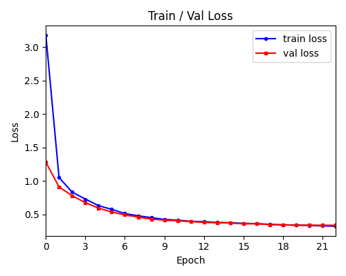

<h1>Coral Reef Halo Segmentation</h1>

     

    This repository contains a fully implemented deep-learning workflow for automated coral reef halo segmentation using high-resolution satellite imagery. The tool is designed to support large-scale ecological monitoring by extracting halo features, clear sand rings around coral patches that are key indicators of reef health, herbivory pressure, and predator–prey dynamics. The workflow is based on a Mask R-CNN model implemented in PyTorch and trained on a curated dataset of manually annotated halos collected from diverse reef environments. The codebase includes all stages of the pipeline, from data preprocessing and augmentation to model training, validation, and inference. Once trained, the model can be used to generate segmentation masks for new satellite scenes, and the provided post-processing functions convert these predictions into clean polygons and GIS-ready outputs.

    

<h3>Usage:</h3>

    Expects data folder structure of: 
    
    
    data_dir/
    ├── img/
    └── mask/
    

    Run in terminal:

    python main.py train train_settings.toml

    <h3>Collaborators:</h3>
        <ul>
            <li>
                Simone Franceschini -
                <a href="https://www.sciencedirect.com/science/article/pii/S0034425723001359">Original author</a>
            </li>
            <li>
                Dorian Yeh - Model workflow implementation
            </li>
            <li>
                Justin J.K. Hill
            </li>
        </ul>

